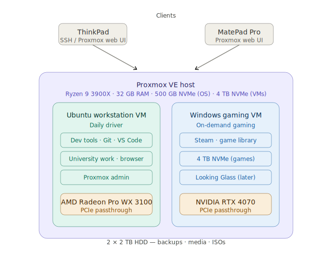

# Proxmox Workstation Platform

## Overview

This project documents the design and implementation of a virtualized workstation platform built using Proxmox.

The primary goal is to separate day-to-day productivity workloads from gaming workloads while maintaining a single physical desktop. Rather than dual-booting between operating systems, the platform uses virtual machines with dedicated hardware resources assigned to each environment.

The project is inspired by principles of workload separation, virtualization, and infrastructure-as-code, while remaining practical for everyday use.

---

## Architecture



The platform runs two VMs on a single Proxmox host, each with a dedicated GPU passed through via PCIe. Clients connect to the Proxmox web UI or via SSH from a ThinkPad laptop or Huawei MatePad Pro.

---

## Objectives

### Primary

- Deploy Proxmox as the host operating system
- Create a dedicated Ubuntu workstation VM for daily use
- Create a dedicated Windows gaming VM
- Implement GPU passthrough for near-native gaming performance
- Document the architecture and implementation process

### Secondary

- Improve Linux administration skills
- Gain practical experience with virtualization technologies
- Learn hardware passthrough and resource allocation
- Build a project suitable for demonstrating infrastructure and systems engineering concepts

---

## Hardware

| Component | Specification |
|---|---|
| CPU | AMD Ryzen 9 3900X |
| RAM | 32 GB DDR4 |
| Primary GPU | NVIDIA RTX 4070 |
| Secondary GPU | AMD Radeon Pro WX 3100 |
| Hypervisor storage | 500 GB NVMe SSD |
| VM storage | 4 TB NVMe SSD |
| Bulk storage | 2× 2 TB HDD |

---

## Why virtualization?

The traditional approach would be to dual-boot Linux and Windows. While simple, dual-booting requires a full system reboot whenever switching between operating systems.

This project explores an alternative architecture where:

- Ubuntu serves as the primary operating environment
- Windows exists as an on-demand gaming environment
- Resources can be allocated dynamically
- Workloads remain separated
- Additional environments can be introduced in the future

---

## Project status

See [ROADMAP.md](ROADMAP.md) for the full version plan.

### Version 1

- [ ] Install Proxmox
- [ ] Configure storage
- [ ] Create Ubuntu workstation VM
- [ ] Create Windows gaming VM
- [ ] Configure GPU passthrough
- [ ] Test gaming performance
- [ ] Complete project documentation

---

## Repository structure

```
proxmox-workstation-platform/
├── README.md
├── ROADMAP.md
├── architecture/
│   └── proxmox_workstation_v1_architecture.svg
├── docs/
│   ├── proxmox-setup.md
│   ├── gpu-passthrough-notes.md
│   └── lessons-learned.md
├── scripts/
└── screenshots/
```

---

## Learning outcomes

This project aims to provide hands-on experience with:

- Linux administration
- Virtualization
- GPU passthrough
- Storage management
- Infrastructure design
- Systems engineering
- Documentation and project management

---

*This project is intended as a personal learning platform and workstation environment. Design decisions prioritise practical usability, maintainability, and learning outcomes over enterprise-scale complexity.*
